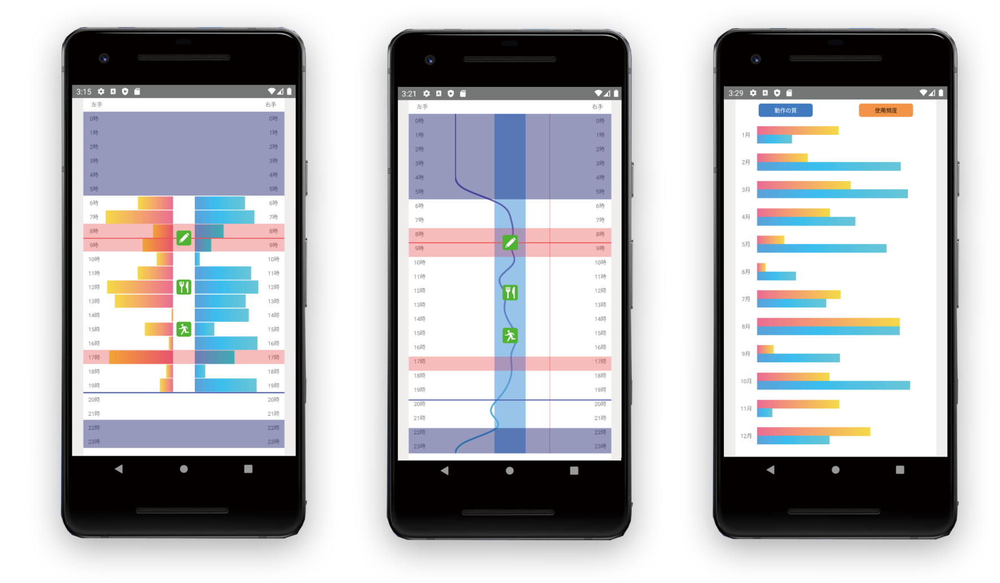

# React Native 用グラフライブラリ

---



## ■ 概要

以下の ADL 用グラフを追加します。

- ADLBarChart
  - 活動量（VM 値）グラフを表示する
    - 日/月/年の 3 種に対応。
- ADLLineChart
  - バランス（MR 値）グラフを表示する
    - 日/月/年の 3 種に対応。
- ADLMalChart
  - 自己評価（MAL）グラフを表示する
    - 年の 1 種に対応。

<div style="page-break-before:always"></div>

## ■ 導入手順

#### ○ 導入

`adl-chart.zip`を解凍後、以下のコマンドを入力します。

```cmd
cd adl-chart
npm install
npx react-native run-android
```

#### ○ 注意点

`react-native-svg（以下svg）`および`react-native-svg-charts（以下charts）`をインストールする際は注意。  
`charts`は`svg`を必須としていますが、`svg`の最新バージョンを入れると過去のバージョンを入れてくださいと指示され、`charts`インストールできなくなります。

そのため一度`svg`のバージョン指定を行って`charts`を導入しますが、今度は古い`svg`ではエラーが起きてしまいます。  
対応として`svg`を一旦アンインストールしたあと、再度`svg`の最新バージョンを入れ直すことで`charts`が利用できるようになります。

```cmd
npm i react-native-svg@6.0.3
npm i react-native-svg-charts
nmp rm react-native-svg
npm i react-native-svg
```

<div style="page-break-before:always"></div>

## ■ ファイル構成

```txt
TEST
|   App.js
|
ADL-CHART
|   adl-chart-base.js
|   index.js
|
+---adl-bar-chart
|       adl-bar-chart-day.js
|       adl-bar-chart-month.js
|       adl-bar-chart-year.js
|       adl-bar-chart.js
|
+---adl-line-chart
|       adl-line-chart-day.js
|       adl-line-chart-month.js
|       adl-line-chart-year.js
|       adl-line-chart.js
|
+---adl-mal-chart
|       adl-mal-chart.js
|
\---adl-utility
        alert-hour-rect.js
        alert-line.js
        current-hour-line.js
        gradient.js
        icon-image.js
        sleep-hour-rect.js
```

<div style="page-break-before:always"></div>

## ■ 使い方

App.js に基本的なチャートのサンプルコードを乗せています。

#### ○ 基本的な使い方

```js
// ./App.js
import {ADLBarChartDay} from './adl-chart';
  ︙
render() {
  ︙
  <ADLBarChartDay
    width={window.width},
    height={window.height},
    datas={
      value1: data1,
      value2: data2,
      ︙
    },
  />
  ︙
}
```

#### ○ サンプルの切り替え

App.js の chartType を変更することでサンプルの表示が変わります。

```js
// ./App.js
  ︙
const _config = {
  cyartType: {
    bar: 0,
    line: 1,
    mal: 2,
  },
};

export default class App extends React {
  #chartType = _config.chartType.bar;
  ︙
};
```

#### ○ その他

その他のプロパティは次の項の仕様を御覧ください。以下のファイルにデフォルト設定が記載されています。

```js
// ./adl-chart/adl-chat-base.js
ADLChartBase.defaultProps = {
  ︙
};
```

<div style="page-break-before:always"></div>

## ■ 仕様

### ● **活動量グラフ**

#### ○ コンポーネント名

- ADLBarChartDay
- ADLBarChartMonth
- ADLBarChartYear

#### ○ 説明

活動量グラフ（日/月/年）の 3 種のグラフを追加します。

#### ○ 必須のプロパティ

- `width [float]`
  - コンポーネントの幅を設定します。
- `height [float]`
  - コンポーネントの高さを設定します。
- `datas [object]`
  - `value1 [array]`
    - 左手データの配列を格納します。
  - `value2 [array]`
    - 右手データの配列を格納します。
- `yMax: [float]`
  - このグラフで表すデータの最大値を設定します。

#### ○ 月指定限定プロパティ

- `dayDate [object]`
  - 月の最大日数を算出するために使用します。
  - `year [number]`
    - 年を設定します。
  - `month [number]`
    - 月を設定します。

#### ○ 任意のプロパティ

- `sleepHourProps [array]`
  - 活動時間外の矩形を表示します。複数オブジェクトが指定でき、複数の矩形表示が可能。
  - `[object]`
    - `startTime [float]`
      - 活動時間外の時間を設定します。浮動小数点が指定できます。[^1]
    - `interval [float]`
      - startTime からの経過時間を入力します。24 時を超過した時間は繰り上がります。[^1]
- `alertHourProps [array]`
  - アラート期間の矩形を表示します。複数オブジェクトが指定でき、複数の矩形表示が可能。浮動小数点が指定できます。[^1]
  - `[object]`
    - `startTime [float]`
      - アラート期間の時間を設定します。浮動小数点が指定できます。[^1]
    - `interval [float]`
      - startTime からの経過時間を入力します。24 時を超過した時間は繰り上がります。浮動小数点が指定できます。[^1]
- `alertLineProps [array]`
  - アラートのあった時間ラインを表示します。複数オブジェクトが指定でき、複数のライン表示が可能。
  - `[object]`
    - `startTime [float]`
      - アラートのあった時間を設定します。浮動小数点が指定できます。[^1]
- `currentHourLineProps [array]`
  - 現在の時間ラインを表示します。複数オブジェクトが指定でき、複数のライン表示が可能。
  - `[object]`
    - `startTime [float]`
      - 現在の時間を設定します。浮動小数点が指定できます。[^1]
- `iconImageProps [array]`
  - アイコンを表示します。複数オブジェクトが指定でき、複数のアイコン指定が可能。
  - `[object]`
    - `hour [float]`
      - アイコンの設置時間を設定します。浮動小数点が指定できます。[^1]
    - `type [string]`
      - アイコンのタイプを設定します。
        - memo : メモタイプのアイコンを表示します。m で省略可能です。
        - eat : 食事タイプのアイコンを表示します。e で省略可能です。
        - activity : 活動タイプのアイコンを表示します。a で省略可能です。

[^1]: 1.0 で 1 時間刻みとなり、60 等分した値が 1 分刻みの値となります。

<div style="page-break-before:always"></div>

### **● バランス(MR 値)グラフ**

#### ○ コンポーネント名

- ADLLineChartDay
- ADLLineChartMonth
- ADLLineChartYear

#### ○ 説明

バランス(MR 値)グラフ（日/月/年）の 3 種のグラフを追加します。

#### ○ 必須のプロパティ

- `width [float]`
  - コンポーネントの幅を設定します。
- `height [float]`
  - コンポーネントの高さを設定します。
- `datas [object]`
  - `value1 [array]`
    - 麻痺手データの配列を格納します。
  - `value2 [array]`
    - 非麻痺手データの配列を格納します。
- `yMin: [float]`
  - このグラフで表すデータの最小値を設定します。デフォルトで-7 が設定されています。
- `yMax: [float]`
  - このグラフで表すデータの最大値を設定します。デフォルトで 7 が設定されています。

#### ○ 目標値 / 閾値

- `targetMin [float]`
  - yMin~yMax の間で設定します。目標値の矩形の始点となります。
- `targetMax [float]`
  - targetMin~yMax の間で設定します。目標値の矩形の終端となります。
- `thValue [float]`
  - yMin~yMax の間で設定します。閾値のラインが表示されます。

#### ○ 月指定限定プロパティ

- `dayDate [object]`
  - 月の最大日数を算出するために使用します。
  - `year [number]`
    - 年を設定します。
  - `month [number]`
    - 月を設定します。

#### ○ 任意のプロパティ

- `sleepHourProps [array]`
  - 活動時間外の矩形を表示します。複数オブジェクトが指定でき、複数の矩形表示が可能。
  - `[object]`
    - `startTime [float]`
      - 活動時間外の時間を設定します。浮動小数点が指定できます。[^1]
    - `interval [float]`
      - startTime からの経過時間を入力します。24 時を超過した時間は繰り上がります。[^1]
- `alertHourProps [array]`
  - アラート期間の矩形を表示します。複数オブジェクトが指定でき、複数の矩形表示が可能。浮動小数点が指定できます。[^1]
  - `[object]`
    - `startTime [float]`
      - アラート期間の時間を設定します。浮動小数点が指定できます。[^1]
    - `interval [float]`
      - startTime からの経過時間を入力します。24 時を超過した時間は繰り上がります。浮動小数点が指定できます。[^1]
- `alertLineProps [array]`
  - アラートのあった時間を表示します。複数オブジェクトが指定でき、複数のライン表示が可能。
  - `[object]`
    - `startTime [float]`
      - アラートのあった時間を設定します。浮動小数点が指定できます。[^1]
- `currentHourLineProps [array]`
  - 現在の時間ラインを表示します。複数オブジェクトが指定でき、複数のライン表示が可能。
  - `[object]`
    - `startTime [float]`
      - 現在の時間を設定します。浮動小数点が指定できます。[^1]
- `iconImageProps [array]`
  - アイコンを表示します。複数オブジェクトが指定でき、複数のアイコン指定が可能。
  - `[object]`
    - `hour [float]`
      - アイコンの設置時間を設定します。浮動小数点が指定できます。[^1]
    - `type [string]`
      - アイコンのタイプを設定します。
        - memo : メモタイプのアイコンを表示します。m で省略可能です。
        - eat : 食事タイプのアイコンを表示します。e で省略可能です。
        - activity : 活動タイプのアイコンを表示します。a で省略可能です。

[^1]: 1.0 で 1 時間刻みとなり、60 等分した値が 1 分刻みの値となります。

<div style="page-break-before:always"></div>

### **● MAL グラフ**

#### ○ コンポーネント名

- ADLMalChart

#### ○ 説明

MAL グラフ(年)の 1 種のグラフを追加します。

#### ○ 必須のプロパティ

- `width [float]`
  - コンポーネントの幅を設定します。
- `height [float]`
  - コンポーネントの高さを設定します。
- `datas [object]`
  - `value1 [array]`
    - 動作の質データの配列を格納します。
  - `value2 [array]`
    - 使用頻度データの配列を格納します。
- `yMax: [float]`
  - このグラフで表すデータの最大値を設定します。デフォルトで 10 が設定されています。

<div style="page-break-before:always"></div>

### **● その他**

#### ○ プロパティ一覧

前項で紹介できなかったその他のプロパティとデフォルト設定の一覧となります。

```js
// デフォルト設定
ADLChart_Base.defaultProps = {
  //*********************************************************
  // 共通
  //*********************************************************
  // 共通スタイル
  width: 411, // 幅
  height: 731, // 高さ
  backgroundColor: '#fff', // 背景色
  fontSize: 10, // フォントサイズ
  marginBottom: 12.5, // 下の余白
  marginX: 40, // 左右の余白

  // データ
  datas: {
    value1: [], // 左手
    value2: [], // 右手
  },

  // 月タイプのチャートに有効。※設定した月の最大日数を算出するため。
  dayDate: {
    year: new Date().getFullYear(), // 年
    month: new Date().getMonth() + 1, // 月
  },

  // チャートをn分割する。
  // 例）時間タイプのチャートで2にすると30分単位でチャートを生成する。
  dayOfHourSplitValue: 1,

  // チャートの最大値
  yMax: 0,

  // 活動時間外の背景色
  sleepHourColor: 'rgba(0, 10, 100, 0.4)',

  // アラート期間の背景色
  alertHourColor: 'rgba(240, 0, 0, 0.25)',

  // アラートラインの背景色
  alertLineColor: '#f55',

  // 現時刻ラインの背景色
  currentHourColor: '#55f',

  // アイコン表示部の余白
  iconAreaWidth: 40,

  // アイコンの拡大率
  iconScale: 1.15,

  // 時間指定
  sleepHourProps: [],
  alertHourProps: [],
  iconImageProps: [],
  alertLineProps: [],
  currentHourProps: [],

  // ヘッダの文字列
  headerText1: '左手',
  headerText2: '右手',

  //*********************************************************
  // ○ 活動量グラフ
  //*********************************************************
  // 棒グラフの色
  barChartColor1: 'url(#True_Sunset)', // 左手
  barChartColor2: 'url(#Malibu_Beach)', // 右手

  //*********************************************************
  // ○ バランスグラフ
  //*********************************************************
  // 折れ線グラフのスタイル
  lineChartWidth: 200, // 幅
  lineChartColor: 'url(#default)', // 色

  // 折れ線グラフの目標値
  targetMin: 0, // 最小値
  targetMax: 0, // 最大値
  targetColor: '#9cf', // 背景色

  // 折れ線グラフの閾値
  thValue: 0, // 閾値
  thColor: '#fcc', // 色

  // 線型補完
  curveFunction: shape.curveBasis,

  //*********************************************************
  // ○ MALグラフ
  //*********************************************************
  // 棒グラフの色
  malChartColor1: 'url(#Malibu_Beach)', // 動作の質
  malChartColor2: 'url(#True_Sunset)', // 使用頻度

  // ヘッダのテキスト
  malHeaderTextAreaWidth: 100,
  malHeaderTextAreaHeight: 25,
  malHeaderTextAreaBorderRadius: 5,
  malHeaderTextFontSize: 10,
  malHeaderTextAreaBackgroundColor1: '#38f',
  malHeaderTextAreaColor1: '#fff',
  malHeaderTextAreaText1: '動作の質',
  malHeaderTextAreaBackgroundColor2: '#f94',
  malHeaderTextAreaColor2: '#444',
  malHeaderTextAreaText2: '使用頻度',
};
```
